## 1. Запуск нескольких Docker-контейнеров с использованием Docker Compose

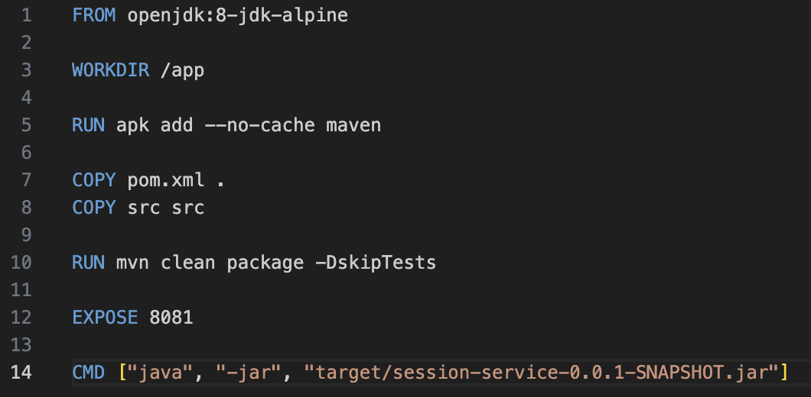

Создаем докерфайлы к каждому сервису на примере session-service.
Docker создает "коробку" с Java, кладет туда наш jar файл и настраивает запуск приложения.

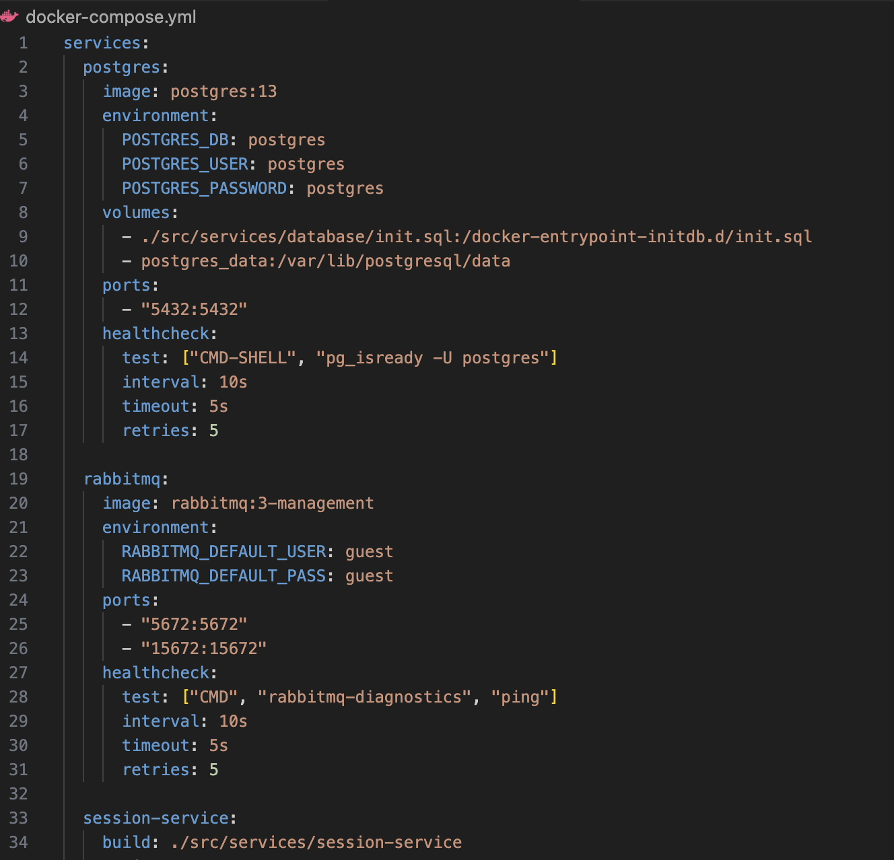

Создаем yml файл для compose.

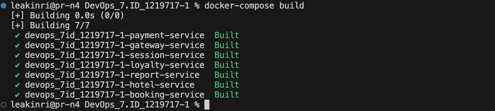
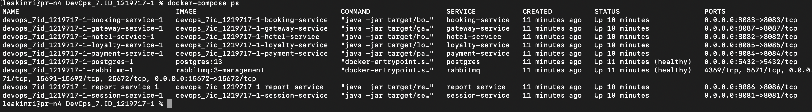

Запускаем с помощью docker-compose build -> docker-compose up -> проверяем статус docker-compose ps.

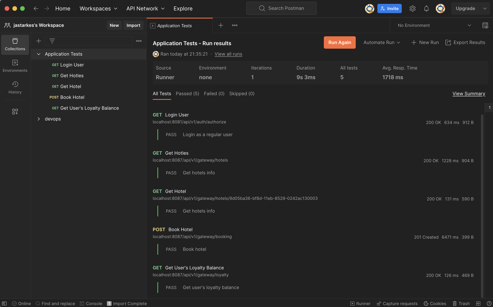

Postman тесты.

## 2. Создание виртуальных машин

Созданы виртуальные машины с помощью vagranfile, подняли через vagrant up, вошли в нее через vagrant ssh, исходный код веб-сервиса перенесен в рабочую директорию виртуальной машины. Далее вышли из неё и уничтожили.

## 3. Создание простейшего Docker Swarm

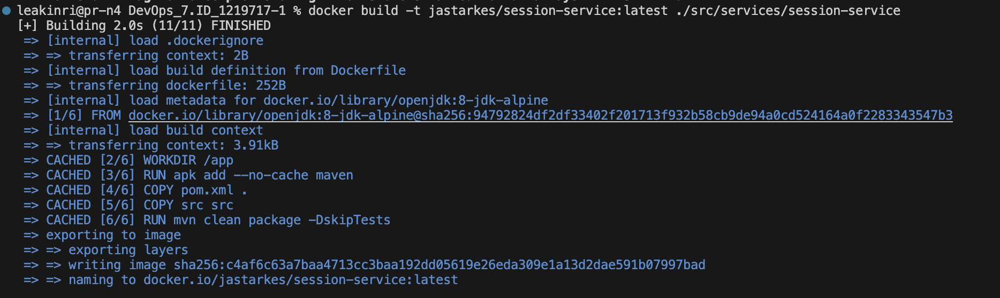

Сборка образов каждого сервиса.

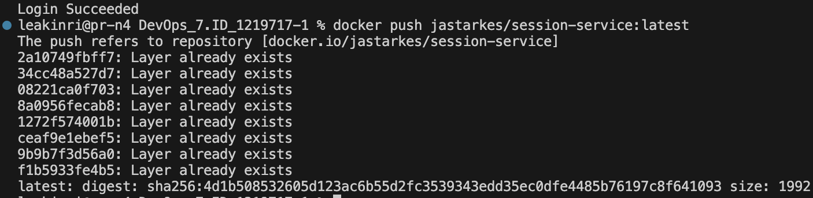

Пуш в docker hub (ранее производилось тегирование).

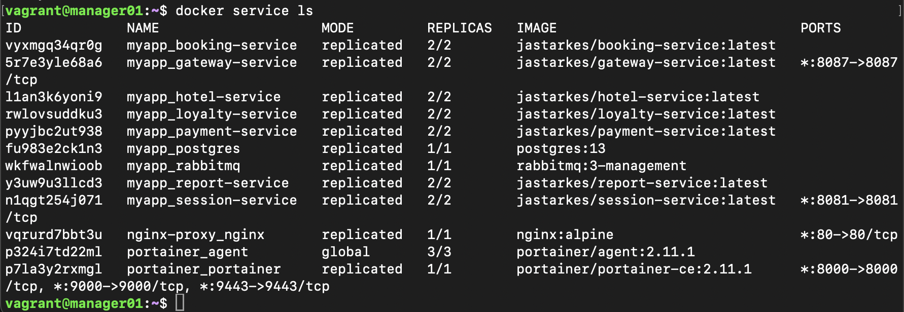

Создан docker-compose-swarm.yml. Произведен деплой микросервисов на вм с помощью docker stack deploy -c docker-compose-swarm.yml myapp. Результат работы сервисов на скрине.

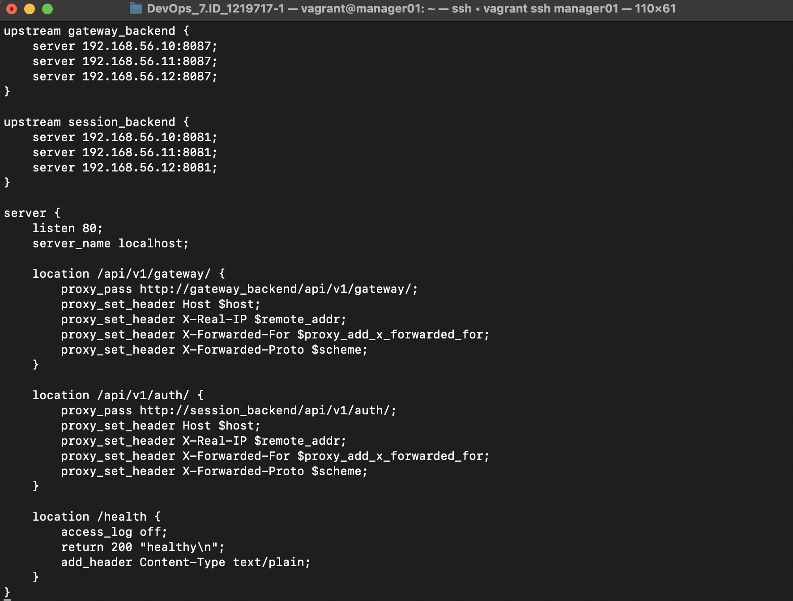
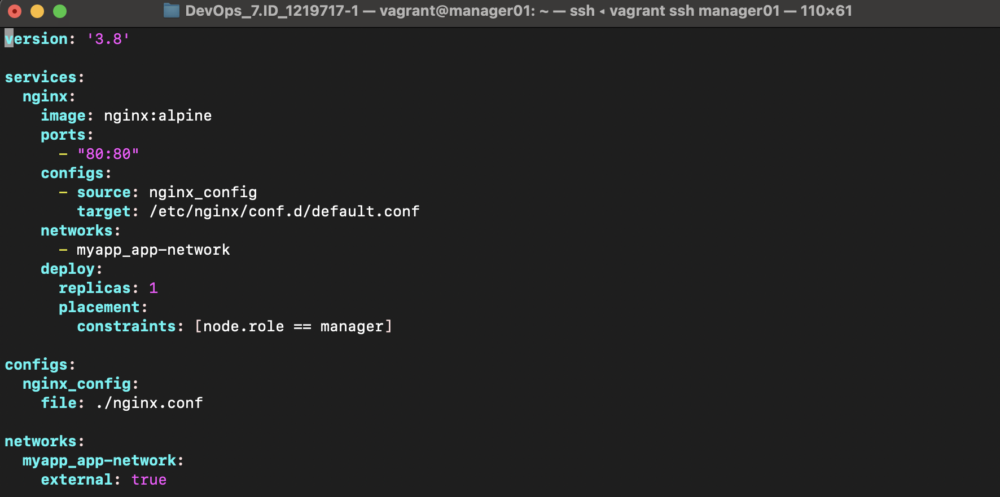

Созданы nginx.conf и nginx-compose.yml

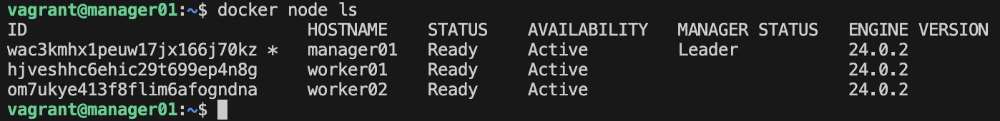

Машины запущены. Микросервисы установлены.

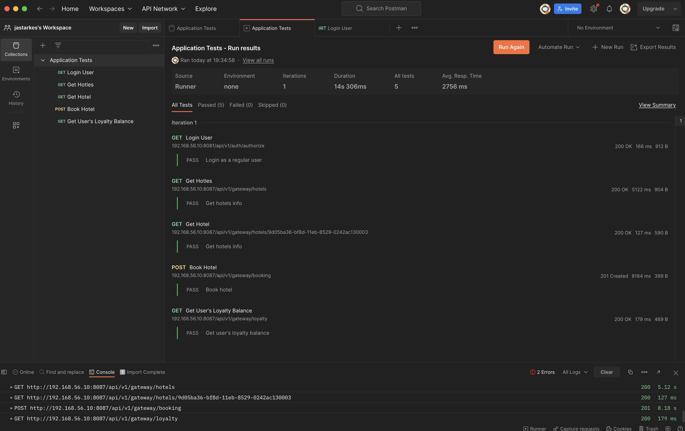

Тесты Postman с виртуальных машин.

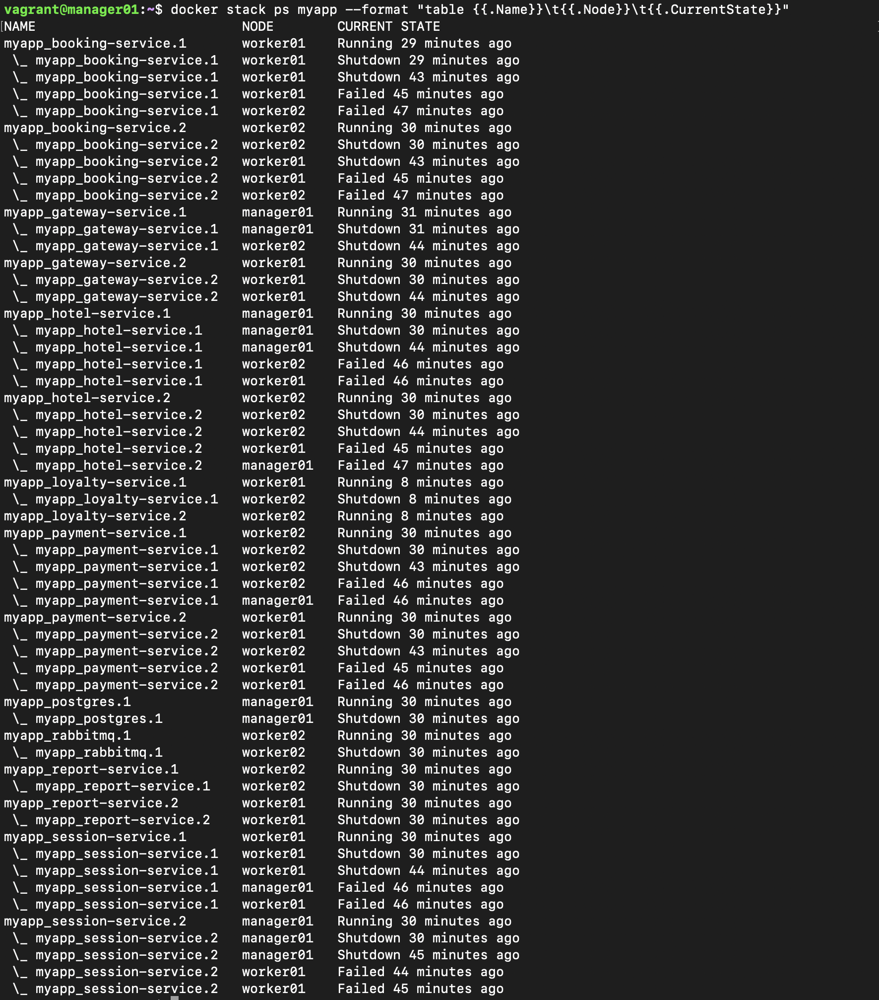

Отчет по собранным микросервисам.

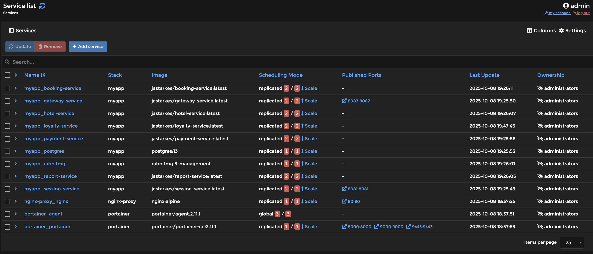
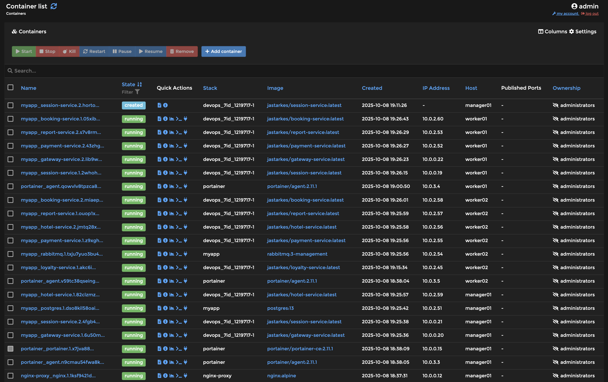
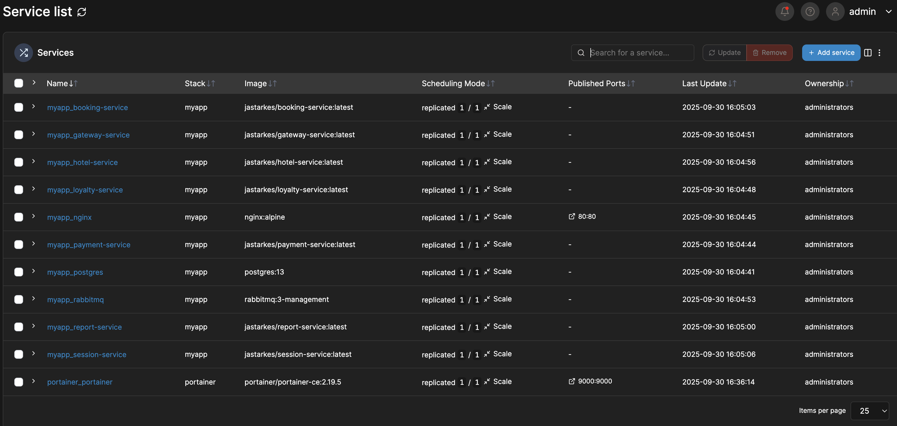

Информация о работе сервисов в Portainer.
